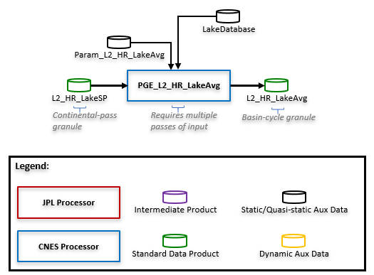
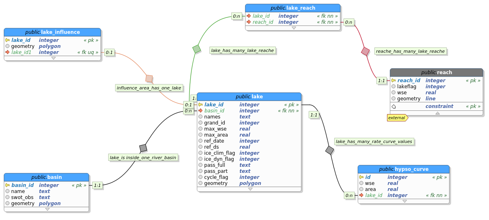

# LakeAvg processor

The LakeAvg processor computes a LakeAvg product from a cycle of LakeSP products on a level-2 basin (as defined by HydroBASINS: <https://hydrosheds.org/page/hydrobasins>):



## Usage
```
usage: pge_lake_avg.py [-h] command_file

Compute SWOT LakeAvg product from one cycle of L2_HR_LakeSP products over one basin.

positional arguments:
  command_file  command file (*.cfg)

optional arguments:
  -h, --help    show this help message and exit
```

### Command file
The command file must contain the following (example provided in ```PGE/pge_lake_avg_command.cfg```):
```
[PATHS]
param_file = <full_path_to_param_file>
LakeSP_Prior directory = <directory_of_LakeSP_Prior_shapefiles>
Output directory = <output_directory>

[DATABASES]
# OPTION 1: upper directory pointing to operational Prior Lake Database (PLD)
LAKE_DB = /work/ALT/swot/swotpub/BD/BD_lakes/PLD

# OPTION 2: lake database in SQLite format
# 2.1 - Filename starts with SWOT_PLD_ = operational Prior Lake Database (PLD)
# 2.2 - Filename doesn't start with SWOT_PLD = personal lake database with model similar to operational PLD 
#       ie containing the following tables: lake, lake_influence, basin
#LAKE_DB = /work/ALT/swot/swotpub/BD/BD_lakes/PLD/Basin/SWOT_LakeDatabase_EU_22_20000101T000000_20991231T235959_20220401T131749_v001.sqlite

# OPTION 3 : lake database in shapefile format
# Filename
# LAKE_DB = /work/ALT/swot/swotpub/BD/BD_lakes/20200702_PLD/PLD_EU.shp
# Lake identifier attribute name in the prior lake database and influence_lake_db
# LAKE_DB_ID = lake_id

[PASS_INFOS]
Cycle number = <int>
Basin code = <int>

[OPTIONS]
# To increment the file counter in the output filenames (=True, default); else=False
Increment file counter = <True|False>
# To write full path in global attributes (=True); to write only basename=False
Write full path = <True|False>
# Number of processors to use (default=1)
Nb_proc = <int>

[LOGGING]
# Error file full path
errorFile = <full_path_to_error_file>
# Log file full path
logFile = <full_path_to_log_file>
# Log level put inside the file
logfilelevel = <DEBUG|INFO>
# Is log console output ?
logConsole = <True|False>
# Log level print in console
logconsolelevel = <DEBUG|INFO>

[FILE_INFORMATION]
# Name of producing agency
INSTITUTION = CNES
# Product version
PRODUCT_VERSION = <Draft|Initial release|...>
# Composite Release IDentifier for LakeSP processing
CRID_LAKESP = <CRID_value>
# Composite Release IDentifier for LakeAvg processing
CRID_LAKEAVG = <CRID_value>
# Version identifier of the product generation executable (PGE)
PGE_VERSION = <X.Y>
# Contact
CONTACT = <xxxx@cnes.fr>
```

### Parameter file
If the __param_file__ key is not set in the command file, the software uses default configuration parameters listed in ```PGE/lake_avg_param.cfg```. If the __param_file__ key is set , the software will use your own configuration parameters.

They are:
* __ADD_ALL__ is a flag to add (=true, default) or not (=False) not-observed PLD lakes as empty features to the LakeAvg product
* __DEL_TMP_SHP__ is a flag to delete (=True, default) or not (=False) temporary sub-basin LakeAvg shapefiles

### Input files

#### The LakeSP_Prior file
The filename pattern should be ```SWOT_L2_HR_LakeSP_Prior_<ccc>_<ppp>_<CC>_<yyyyMMddThhmmss>_<yyyyMMddThhmmss>_<CRID>_<nn>.nc``` where:
* __ccc__ is the cycle number, on 3 digits
* __ppp__ is the pass number, on 3 digits
* __CC__ is the continent reference, on 2 letters; for ex: "EU" for Europe; the continental splitting has been retrieved from HydroBASINS splitting
* First __yyyyMMddThhmmss__ is the start date of the tile
* Second __yyyyMMddThhmmss__ is the end date of the tile
* __CRID__ is the Composite Release IDentifier
* __nn__ is a product counter with the same CRID

### Prior Lake Database (PLD)
If the __LAKE_DB__ parameter is set in the command file, cycle-averaged storage change will be computed.

The __LAKE_DB__ is the full path of the prior lake database. 

The operational database is in SQLite format. The model is available below.



An alternative polygon shapefile may also be used. Each feature corresponds to a prior lake. The attribute corresponding to the identifier is specified in the command file, by the __LAKE_DB_ID__ parameter.

Furthermore, if there are 2 or 3 more attributes names *ref_height* and *ref_area*, and eventually *ds_t0*, in the a priori database, the storage change will be computed with regards to these reference values.

NB: if the __LAKE_DB__ parameter is not set, the cycle-averaged storage change is not computed.

### Output file = The LakeAvg file
The LakeAvg pattern is ```SWOT_L2_HR_LakeAvg_<ccc>_<CC>_<B>_<yyyyMMddThhmmss>_<yyyyMMddThhmmss>_<CRID>_<nn>.<extension>``` where:
* __ccc__ is the cycle number, on 3 digits
* __ppp__ is the pass number, on 3 digits
* __CC__ is the continent reference, on 2 letters; for ex: "EU" for Europe; the continental splitting has been retrieved from HydroBASINS splitting
* __B__ is level-2 basin digit, retrieved from HydroBASINS
* First __yyyyMMddThhmmss__ is the start date of the cycle
* Second __yyyyMMddThhmmss__ is the end date of the cycle
* __CRID__ is the Composite Release IDentifier
* __nn__ is a product counter with the same CRID
* __extension__ is shapefile (.shp and other)

## Multi-basins processing
```
usage: multi_lake_avg.py [-h] command_file

Compute SWOT LakeAvg products from multiple LakeSP products.

positional arguments:
  command_file  command file (*.cfg)

optional arguments:
  -h, --help    show this help message and exit
```

The command file must have the same content as the one for ```pge_lake_avg.py``` (see above) (example provided in ```PGE/multi_lake_avg_command.cfg```).

Only processing of __PASS_INFOS__ section differs:
* __Cycle number__ is the number of the cycle to process
  * if empty, all the LakeSP_Prior files in input directory will be processed
* __Basin code__ is the code of basin to process
  * if one digit: corresponds to continent; deal with all LakeSP_Prior files in LakeSP_Prior directory with selected continent
  * if empty, deal with all basin_code available in LakeSP_Prior directory

NB: if not used, parameters HAVE TO be removed or in comment (#)

## Algorithm main steps

1. Preprocessing:
	1. Test the existence of input paths
	2. Compute list of LakeSP_Prior filenames to handle per level-3 sub-basin (CBB) (from basin_code info in .shp.xml files)
2. Processing; for each level-3 sub-basin:
	1. Retrieve prior lakes from Prior Lake Database over the CBB region
	2. Read LakeSP_Prior shapefiles and retrieve lakes needed lakes infos over the CBB basin
	3. Prepare output data for the CBB basin
	4. Compute LakeAvg features over the CBB basin
	5. Write them in a temporary shapefile
	6. Close prior lake database
3. Post-processing
	1. Aggregate all temporary shapefiles in the output LakeAvg shapefile
	2. Remove temporary shapefiles if asked
