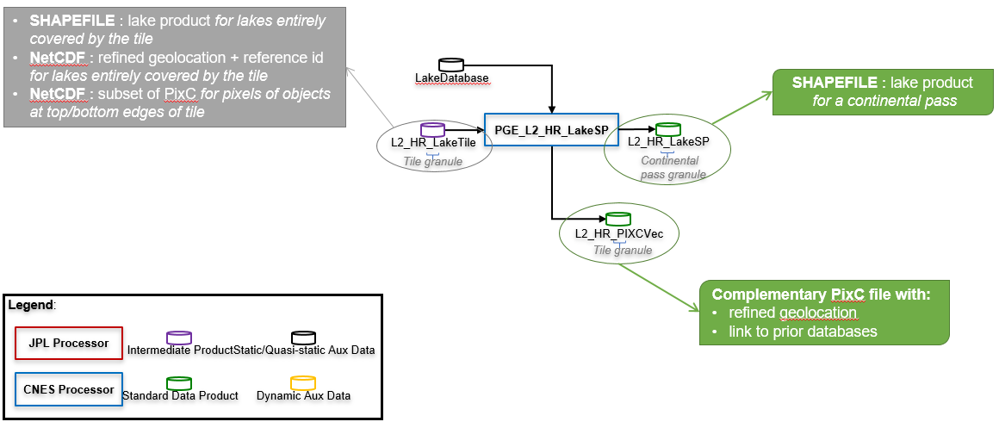

# LakeSP processor

## Purpose
The LakeSP processor computes a lake single-pass product from tiles of LakeTile files related to specific cycle, pass and continent:



## Usage
```
usage: pge_lake_sp.py [-h] command_file

Compute SWOT LakeSP product from all LakeTile products related to the same cycle and pass.

positional arguments:
  command_file  command file (*.cfg)

optional arguments:
  -h, --help    show this help message and exit
```

### Command file
The command file must contain the following (example provided in ```PGE/pge_lake_sp_command.cfg```):
```
[PATHS]
param_file = <full_path_to_param_file>
LakeTile directory = <full_path_to_LakeTile_directory>
Output directory = <output_directory>

[DATABASES]
# OPTIION 1 : SQLITE lake database containing  : lake_table, lake_influence_table, basin_table
LAKE_DB = /work/ALT/swot/swotpub/BD/BD_lakes/20200309_PLD/PLD_EU.sqlite

# OPTION 2 : SHP lake database
# Prior lake database
# LAKE_DB = /work/ALT/swot/swotpub/BD/BD_lakes/20200309_PLD/PLD_EU.shp
# Lake identifier attribute name in the prior lake database and influence_lake_db
# LAKE_DB_ID = lake_id

[TILES_INFOS]
Cycle number = <cycle_number>
Pass number = <pass_number>

[OPTIONS]
# To also produce LakeTile_edge and LakeTile_pixcvec as shapefiles (=True); else=False (default)
Produce shp = <True|False>

[LOGGING]
# Error file full path
errorFile = <full_path_to_error_file>
# Log file full path
logFile = <full_path_to_log_file>
# Log level put inside the file
logfilelevel = <DEBUG|INFO>
# Is log console output ?
logConsole = <True|False>
# Log level print in console
logconsolelevel = <DEBUG|INFO>

[FILE_INFORMATION]
# Composite Release IDentifier for LakeTile processing
CRID_LAKETILE = <CRID_value>
# Composite Release IDentifier for LakeSP processing
CRID_LAKESP = <CRID_value>
# Producer
PRODUCER = CNES
# Method of production of the original data
SOURCE = Simulation
# Software version
SOFTWARE_VERSION = <X.Y>
# Contact
CONTACT = <xxxx@cnes.fr>
```

### Parameter file
If the __param_file__ key is not set in the command file, the software uses default configuration parameters listed in ```PGE/lake_sp_param.cfg```. If the __param_file__ key is set , the software will use your own configuration parameters.

They are:
* __FLAG_WATER__ is the list of water flags to keep for processing (3=water near land edge  4=interior water)
* __FLAG_DARK__ is the list of dark water flags to keep for processing (23=dark water near land edge  24=interior dark water)
* __MIN_SIZE__ is the minimum size for a lake to generate a lake product (=polygon + attributes) for it
* __STD_HEIGHT_MAX__ is the maximal standard deviation of height inside a lake; this value is used to distinguish different lakes that may be merged in the radar geometry
* __IMP_GEOLOC__ is the flag to improve PixC golocation (=True) or not (=False)
* __HULL_METHOD__ is the method to compute lake boundary (or polygon hull): 
  * 0 = convex hull
  * 1.0 = concave hull computed in ground geometry, based on Delaunay triangulation - using CGAL library 
  * 1.1 = concave hull computed in ground geometry, based on Delaunay triangulation - with alpha parameter varying across-track
  * 2 = edge computed in radar geometry, then converted in ground geometry (default)
* __NB_PIX_MAX_DELAUNEY__ is the max number of pixels used for Delaunay triangulation (when ```HULL_METHOD = 1.1```)
* __NB_PIX_MAX_CONTOUR__ is the maximum number of contour points (when ```HULL_METHOD = 2```)
* __BIGLAKE_MODEL, BIGLAKE_MIN_SIZE, BIGLAKE_GRID_SPACING, BIGLAKE_GRID_RES__ are parameters specific to the processing of "big" lakes, ie. lakes with an area greater than BIGLAKE_MIN_SIZE
* __NB_DIGITS__ are the number of digits for a counter of lakes in a tile or pass, used in the LakeID of each observed lake

### Input files
The LakeTile pattern is ```SWOT_L2_HR_LakeTile_<FileIdentifier>_<ccc>_<ppp>_<ttt><s>_<yyyyMMddThhmmss>_<yyyyMMddThhmmss>_<CRID>_<nn>.<extension>``` where:
* __ccc__ is the cycle number, on 3 digits
* __ppp__ is the pass number, on 3 digits
* __ttt__ is the tile number, on 3 digits
* __s__ is the swath: =L for Left swath =R for right swath
* First __yyyyMMddThhmmss__ is the start date of the tile
* Second __yyyyMMddThhmmss__ is the end date of the tile
* __CRID__ is the Composite Release IDentifier
* __nn__ is a product counter with the same CRID
* __extension__ is shapefile (.shp and other) or NetCDF (.nc)

The __FileIdentifier__ tag refers to one of the 5 following files:
* The __"_Obs" shapefile__ contains all observed features that are linked to one or more prior lake(s).
* The __"_Prior" shapefile__ contains all prior features that have been overflown by SWOT. They may have been observed (in this case, the prior feature is related to 1 or more observed feature(s) and its attributes are populated) or not (in this case, the prior feature is not related to any observed feature and its attributes are not populated).
* The __"_Unassigned" shapefile__ contains all observed features that are not linked to any prior lake.
* The __"_PIXCVec" NetCDF file__ contains the PIXCVec product (ie. height-constrained geolocation and link to a PLD lake for each pixel already processed by the RiverTile processor and pixels of observed feature entirely covered by the swath in the along-track direction).
* The __"_Edge" NetCDF file__ contains the subset of PIXC file for pixels belonging to lakes cut in the along-track (i.e. "top" or "bottom") of the tile edge.

### Output files

#### The lake single-pass file
The LakeSP pattern is ```SWOT_L2_HR_LakeSP_<FileIdentifier>_<ccc>_<ppp>_<CC>_<yyyyMMddThhmmss>_<yyyyMMddThhmmss>_<CRID>_<nn>.shp``` where:
* __ccc__ is the cycle number, on 3 digits
* __ppp__ is the pass number, on 3 digits
* __CC__ is the continent reference, on 2 letters; for ex: "EU" for Europe; the continental splitting has been retrieved from HydroBASINS splitting
* First __yyyyMMddThhmmss__ is the start date of the tile
* Second __yyyyMMddThhmmss__ is the end date of the tile
* __CRID__ is the Composite Release IDentifier
* __nn__ is a product counter with the same CRID

The __FileIdentifier__ tag refers to one of the 3 following files:
* The __"_Obs" shapefile__ contains all observed features that are linked to one or more prior lake(s).
* The __"_Prior" shapefile__ contains all prior features that have been overflown by SWOT. They may have been observed (in this case, the prior feature is related to 1 or more observed feature(s) and its attributes are populated) or not (in this case, the prior feature is not related to any observed feature and its attributes are not populated).
* The __"_Unassigned" shapefile__ contains all observed features that are not linked to any prior lake.

#### The PIXCVec file
This is the file complementary to the PIXC file, containing height-constrained geolocation and link to 1 a priori lake for each pixel.

The PIXCVec pattern is ```SWOT_L2_HR_PIXCVec_<ccc>_<ppp>_<ttt><s>_<yyyyMMddThhmmss>_<yyyyMMddThhmmss>_<CRID>_<nn>.nc``` where:
* __ccc__ is the cycle number, on 3 digits
* __ppp__ is the pass number, on 3 digits
* __ttt__ is the tile number, on 3 digits
* __s__ is the swath: =L for Left swath =R for right swath
* First __yyyyMMddThhmmss__ is the start date of the tile
* Second __yyyyMMddThhmmss__ is the end date of the tile
* __CRID__ is the Composite Release IDentifier
* __nn__ is a product counter with the same CRID

## Multi-SP processing
```
usage: multi_lake_sp.py [-h] command_file

Compute multiple SWOT LakeSP products from LakeTile products corresponding to one or more specific (cycle, pass).

positional arguments:
  command_file  command file (*.cfg)

optional arguments:
  -h, --help    show this help message and exit
```

The command file must have almost the same content as the one for ```pge_lake_tile.py``` (see above):
* __cycle_number__: if not used (i.e. removed or in comment (#)), deal with all LakeTile files in LakeTile directory
* __pass_number__: if not used (i.e. removed or in comment (#)), deal with all LakeTile files of cycle "Cycle" in LakeTile directory

## Algorithm main steps


