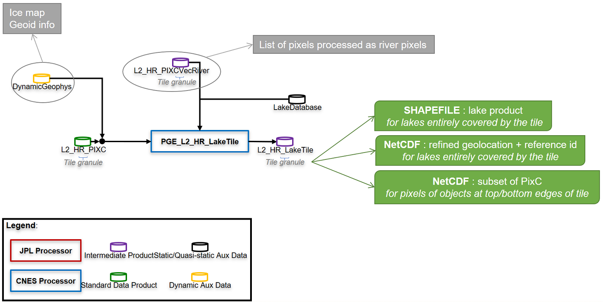
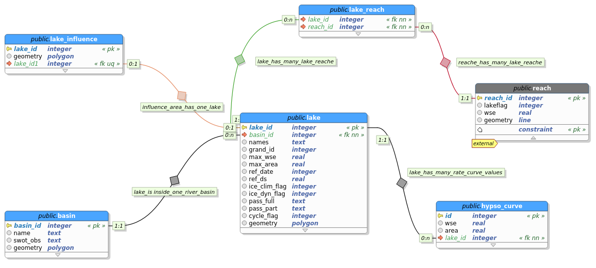

# LakeTile processor

The LakeTile processor computes a LakeTile product from a pixel cloud (PixC) file and its associated PIXCVecRiver on the same tile:



## Usage
```
usage: pge_lake_tile.py [-h] command_file

Compute SWOT LakeTile product from one tile of PIXC product and its associated PIXCVecRiver product.

positional arguments:
  command_file  command file (*.cfg)

optional arguments:
  -h, --help    show this help message and exit
```

### Command file
The command file must contain the following (example provided in ```PGE/pge_lake_tile_command.cfg```):
```
[PATHS]
param_file = <full_path_to_param_file>
PIXC file = <full_path_to_PIXC_file>
PIXCVecRiver file = <full_path_to_PIXCVecRiver_file>
Output directory = <output_directory>

[DATABASES]
# OPTION 1: upper directory pointing to operational Prior Lake Database (PLD)
LAKE_DB = /work/ALT/swot/swotpub/BD/BD_lakes/PLD

# OPTION 2: lake database in SQLite format
# 2.1 - Filename starts with SWOT_PLD_ = operational Prior Lake Database (PLD)
# 2.2 - Filename doesn't start with SWOT_PLD = personal lake database with model similar to operational PLD 
#       ie containing the following tables: lake, lake_influence, basin
#LAKE_DB = /work/ALT/swot/swotpub/BD/BD_lakes/PLD/Cal/SWOT_LakeDatabase_Cal_001_20000101T000000_20991231T235959_20211103T133032_v001.sqlite
#LAKE_DB = /work/ALT/swot/swotpub/BD/BD_lakes/PLD/Nom/SWOT_LakeDatabase_Nom_001_20000101T000000_20991231T235959_20211103T133032_v001.sqlite

# OPTION 3 : lake database in shapefile format
# Filename
# LAKE_DB = /work/ALT/swot/swotpub/BD/BD_lakes/20200702_PLD/PLD_EU.shp
# Lake identifier attribute name in the prior lake database and influence_lake_db
# LAKE_DB_ID = lake_id

[OPTIONS]
# To also produce LakeTile_Edge and LakeTile_PIXCVec as shapefiles (=True); else=False (default)
Produce shp = <True|False>
# To increment the file counter in the output filenames (=True, default); else=False
Increment file counter = <True|False>
# To write full path in global attributes (=True); to write only basename=False
Write full path = <True|False>

[LOGGING]
# Error file full path
errorFile = <full_path_to_error_file>
# Log file full path
logFile = <full_path_to_log_file>
# Log level put inside the file
logfilelevel = <DEBUG|INFO>
# Is log console output ?
logConsole = <True|False>
# Log level print in console
logconsolelevel = <DEBUG|INFO>

[FILE_INFORMATION]
# Name of producing agency
INSTITUTION = CNES
# Product version
PRODUCT_VERSION = <Draft|Initial release|...>
# Composite Release IDentifier for LakeTile processing
CRID = <CRID_value>
# Version identifier of the product generation executable (PGE)
PGE_VERSION = <X.Y>
# Contact
CONTACT = <xxxx@cnes.fr>
```

### Parameter file
If the __param_file__ key is not set in the command file, the software uses default configuration parameters listed in ```PGE/lake_tile_param.cfg```. If the __param_file__ key is set , the software will use your own configuration parameters.

They are:
* __CLASSIF_LIST__ is the list of classif flags to keep for processing (2=land_near_water  3=water_near_land   4=open_water  5=dark_water)
* __CLASSIF_WATER__ is the True/False list of classif flags which contain observed water (1-to-1 correspondance with CLASSIF_LIST)
* __CLASSIF_4HULL__ is the True/False list of classif flags to use for lake boundary construction (1-to-1 correspondance with CLASSIF_LIST)
* __CLASSIF_4WSE__ is the True/False list of classif flags to use for WSE computation (1-to-1 correspondance with CLASSIF_LIST)
* __CLASSIF_4AREA__ is the True/False list of classif flags to use for lake area computation (1-to-1 correspondance with CLASSIF_LIST)
* __USE_FRACTIONAL_INUNDATION__ is the True/False list of classif flags to use water fraction for inundated computation (1-to-1 correspondance with CLASSIF_LIST)
* __PIXC_QUAL_LIST__ is the list of quality flags to consider for PixC selection
* __PIXC_QUAL_MASK__ is the list of mask of quality flags to use for PixC selection (1-to-1 correspondance with PIXC_QUAL_LIST)
* __EXCLUDE_BRIGHT_LAND__ is the flag to exclude PixC having bright_land_flag=1 (=True) or not (=False)
* __MIN_XTRACK__ is the minimum cross-track distance to select PixC (-1 to disable)
* __MAX_XTRACK__ is the maximum cross-track distance to select PixC (-1 to disable)
* __MIN_SIZE__ is the minimum size for a lake to generate a lake product (=polygon + attributes) for it
* __MAX_NB_TILES_FULL_AZ__ is the maximum number of azimuth tiles fully covered by a lake processed in LakeSP. If, in LakeDatabase, lake_table.nb_tiles_az*lake.swath_overlap > MAX_NB_TILES_FULL_AZ, then lake is partially processed in each LakeTile and then gathered in LakeSP, instead of fully processed in LakeSP (-1 to disable)
* __MIN_OVERLAP__ is the minimum percentage of overlapping area to consider a PLD lake linked to an observed feature
* __AREA_METHOD__ is the method to compute area_total attribute
  * polygon = area_total is the area of the polygon of the water region
  * pixc = area_total is computed using JPL aggregate function (default)
* __SEGMENTATION_METHOD__ is the segmentation method chosen; this value is used to distinguish different lakes that may be merged in the radar geometry
  * 1 = Felzenszwalb
  * 2 = SLIC
  * 3 = Unsupervised thresholding
  * 4 = Watershed segmentation method
  * 5 = k-means clustering method
  * 6 = hierarchical clustering
  * 7 (default) = Otsu thresholding
  * 8 = MeanShift
* __IMP_GEOLOC__ is the flag to improve PixC geolocation (=True) or not (=False)
* __HULL_METHOD__ is the method to compute lake boundary (or polygon hull): 
  * 0 = convex hull 
  * 1.0 = concave hull computed in ground geometry, based on Delaunay triangulation - using CGAL library
  * 1.1 = concave hull computed in ground geometry, based on Delaunay triangulation (time consuming)
  * 1.2 = concave hull computed in ground geometry, based on Delaunay triangulation with alpha parameter varying along range
  * 2.0 = edge computed in radar geometry, then converted in ground geometry by reordering lon lat (default)
  * 2.1 = edge computed in radar geometry, then converted in ground geometry by checking each segment
* __NB_PIX_MAX_DELAUNEY__ is the max number of pixels used for Delaunay triangulation (when ```HULL_METHOD = 1.1```)
* __BIGLAKE_MIN_SIZE, BIGLAKE_MODEL, BIGLAKE_GRID_SPACING, BIGLAKE_GRID_RES__ are parameters specific to the processing of "big" lakes, ie. lakes with an area greater than BIGLAKE_MIN_SIZE
* __STOCC_INPUT__ is the choice of input data to compute storage change:
  * obs = use of WSE and area of all distinct observed-oriented features related to the PLD lake
  * pld = averaged WSE and total area of the prior feature (default)
* __THRESHOLD_4NOMINAL__ is the threshold of good pixels within a lake to set lake feature quality flag
* __NB_DIGITS__ is the number of digits for a counter of lakes in a tile or pass, used in the obs_id identifier of each observed lake

### Input files

#### The pixel cloud PIXC file
The filename pattern should be ```SWOT_L2_HR_PIXC_<ccc>_<ppp>_<ttt><s>_<yyyyMMddThhmmss>_<yyyyMMddThhmmss>_<CRID>_<nn>.nc``` where:
* __ccc__ is the cycle number, on 3 digits
* __ppp__ is the pass number, on 3 digits
* __ttt__ is the tile number, on 3 digits
* __s__ is the swath side: =L for Left swath =R for right swath
* First __yyyyMMddThhmmss__ is the start date of the tile
* Second __yyyyMMddThhmmss__ is the end date of the tile
* __CRID__ is the Composite Release IDentifier
* __nn__ is a product counter with the same CRID

NB: this pattern can be modified in the configuration file (see hereafter).

#### The PIXCVecRiver file
This is the file complementary to the PIXC file, containing improved geolocation and link to a priori data for each pixel already processed by the RiverTile processor (see flow diagram).

The filename pattern should be ```SWOT_L2_HR_PIXCVecRiver_<ccc>_<ppp>_<ttt><s>_<yyyyMMddThhmmss>_<yyyyMMddThhmmss>_<CRID>_<nn>.nc``` where:
* __ccc__ is the cycle number, on 3 digits
* __ppp__ is the pass number, on 3 digits
* __ttt__ is the tile number, on 3 digits
* __s__ is the swath side: =L for Left swath =R for right swath
* First __yyyyMMddThhmmss__ is the start date of the tile
* Second __yyyyMMddThhmmss__ is the end date of the tile
* __CRID__ is the Composite Release IDentifier
* __nn__ is a product counter with the same CRID

NB: this pattern can be modified in the configuration file (see hereafter).

NB2: a test is done to verify compatibility of input files regarding their filenames (orbit infos). If something strange is noticed, a WARNING is risen, but it's not blocking.

### Prior Lake Database (PLD)
If the __LAKE_DB__ parameter is set in the command file, each lake polygon in the output product will be linked (if possible) to one or more lakes of this a priori database.

The __LAKE_DB__ is the full path of the prior lake database. 

The operational database is in SQLite format. The model is available below.



An alternative polygon shapefile may also be used. Each feature corresponds to a prior lake. The attribute corresponding to the identifier is specified in the command file, by the __LAKE_DB_ID__ parameter. Thus, the *obs_id* attribute, refering to an observed feature, will point toward one or more *lake_id* of the prior lake database, and vice-versa.

Furthermore, if there are 2 or 3 more attributes names *max_height* and *max_area*, and eventually *ref_ds*, in the a priori database, the storage change will be computed with regards to these reference values.

NB: if the __LAKE_DB__ parameter is not set, output lake polygons are not linked to prior lakes and, therefore, the storage change is not computed.

### Output files
The LakeTile product is composed of the 5 files described hereafter.

#### The LakeTile_Obs file
The LakeTile pattern is ```SWOT_L2_HR_LakeTile_<FileIdentifier>_<ccc>_<ppp>_<ttt><s>_<yyyyMMddThhmmss>_<yyyyMMddThhmmss>_<CRID>_<nn>.<extension>``` where:
* __ccc__ is the cycle number, on 3 digits
* __ppp__ is the pass number, on 3 digits
* __ttt__ is the tile number, on 3 digits
* __s__ is the swath: =L for Left swath =R for right swath
* First __yyyyMMddThhmmss__ is the start date of the tile
* Second __yyyyMMddThhmmss__ is the end date of the tile
* __CRID__ is the Composite Release IDentifier
* __nn__ is a product counter with the same CRID
* __extension__ is shapefile (.shp and other) or NetCDF (.nc)

The __FileIdentifier__ tag refers to one of the 5 following files:
* The __"_Obs" shapefile__ contains all observed features that are linked to one or more prior lake(s).
* The __"_Prior" shapefile__ contains all prior features that have been overflown by SWOT. They may have been observed (in this case, the prior feature is related to 1 or more observed feature(s) and its attributes are populated) or not (in this case, the prior feature is not related to any observed feature and its attributes are not populated).
* The __"_Unassigned" shapefile__ contains all observed features that are not linked to any prior lake.
* The __"_PIXCVec" NetCDF file__ contains the PIXCVec product (ie. height-constrained geolocation and link to a PLD lake for each pixel already processed by the RiverTile processor and pixels of observed feature entirely covered by the swath in the along-track direction).
* The __"_Edge" NetCDF file__ contains the subset of PIXC file for pixels belonging to lakes cut in the along-track (i.e. "top" or "bottom") of the tile edge.

## Multi-tile processing
```
usage: multi_lake_tile.py [-h] command_file

Compute SWOT LakeTile products from multiple tiles of PIXC products and their associated PIXCVecRiver products.

positional arguments:
  command_file  command file (*.cfg)

optional arguments:
  -h, --help    show this help message and exit
```

The command file must have the same content as the one for ```pge_lake_tile.py``` (see above) and a section dedicated to tiles caracteristics (example provided in ```PGE/multi_lake_tile_command.cfg```):
```
[TILES_INFOS]
# Format = int; if empty, deal with all PixC files in PIXC directory
Cycle number = <int>
# Format = int; if empty, deal with all PixC files of the cycle defined above in PIXC directory
#Pass number = <int>
# Tile number (ttt) and swath (s) in string format ("ttts"); if empty, deal with all PixC files of cycle "Cycle" and pass "Pass" in PIXC directory
#Tile ref = <ttts>
```

NB: if not used, parameters HAVE TO be removed or in comment (#)

In particular:
* __Cycle number__ is the number of the cycle to process; if empty, all the PixC files in PIXC directory will be processed
* __Pass number__ is the number of the pass to process, associated to the cycle number above; if empty, deal with all PixC files of __Cycle number__ in PIXC directory
* __Tile ref__ is the tile number (ttt) and swath (s) in string format ("ttts"); if empty, deal with all PixC files of cycle and pass numbers above in PIXC directory

## Algorithm main steps

1. Preprocessing:
	1. Test the existence of input paths
	2. Retrieve tile infos from PIXC filename
	3. Retrieve prior lake database information
	4. Retrieve data from PIXC and PIXCVecRiver input files, i.e. pixels not already processed by RiverTile processor
	5. Init output structures, i.e. LakeTile_Obs_tmp and LakeTile_Prior memory layers, LakeTile_Edge and LakeTile_PIXCVec arrays
2. Processing
	1. Identify all separate entities in the water mask (radar geometry)
	2. Get pixels corresponding to objects entirely inside the tile
	3. Populate LakeTile_Obs_tmp shapefile for each observed feature entirely inside the tile: refine geolocation, build boundary, compute basic attributes, and eventually link to 1 or more lakes from a priori database
	4. For each observed PLD lake, build boundary and compute basic attributes, compute storage change and update related _Obs features 
	5. Add unobserved PLD lakes to the _Prior layer
3. Post-processing
	1. Write LakeTile_Obs (i.e. LakeTile_Obs_tmp layer without unassigned features), _Prior and _Unassigned (i.e. LakeTile_Obs_tmp without features linked to PLD) shapefiles
	2. Write LakeTile_PIXCVec.nc file = PIXCVecRiver file + same info for pixels of objects entirely inside the tile (may be empty)
	3. Write LakeTile_Edge.nc file = subset of PIXC for each pixel of object at top or bottom edge of the tile (may be empty)
	4. Close prior lake database
