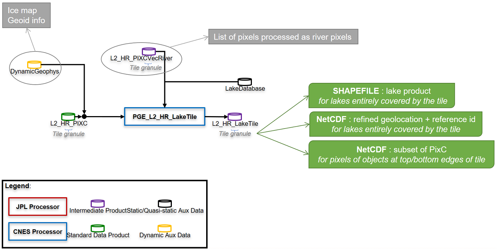

# LakeTile processor

## Purpose
The LakeTile processor computes a LakeTile product from a PIXC (pixel cloud) file and its associated PIXCVecRiver on the same tile:



### Input files

#### The pixel cloud PIXC file
The filename pattern should be ```SWOT_L2_HR_PIXC_I_<ccc>_<ppp>_<ttt><s>_<yyyyMMddThhmmss>_<yyyyMMddThhmmss>_<CRID>_<nn>``` where:
* __ccc__ is the cycle number, on 3 digits
* __ppp__ is the pass number, on 3 digits
* __ttt__ is the tile reference, on 3 digits; for ex: "45N"
* __s__ is the swath: =L for Left swath =R for right swath
* First __yyyyMMddThhmmss__ is the start date of the tile
* Second __yyyyMMddThhmmss__ is the end date of the tile
* __CRID__ is the Composite Release IDentifier
* __nn__ is a product counter with the same CRID

NB: this pattern can be modified in the configuration file (see hereafter).

#### The PIXCVecRiver file
This is the file complementary to the PIXC file, containing improved geolocation and link to a priori data for each pixel already processed by the RiverTile processor (see flow diagram).

The filename pattern should be ```SWOT_L2_HR_PIXCVecRiver_<ccc>_<ppp>_<ttt><s>_<yyyyMMddThhmmss>_<yyyyMMddThhmmss>_<CRID>_<nn>``` where:
* __ccc__ is the cycle number, on 3 digits
* __ppp__ is the pass number, on 3 digits
* __ttt__ is the tile reference, on 3 digits; for ex: "45N"
* __s__ is the swath: =L for Left swath =R for right swath
* First __yyyyMMddThhmmss__ is the start date of the tile
* Second __yyyyMMddThhmmss__ is the end date of the tile
* __CRID__ is the Composite Release IDentifier
* __nn__ is a product counter with the same CRID

NB: this pattern can be modified in the configuration file (see hereafter).

NB2: a test is done to verify compatibility of input files regarding their filenames (orbit infos). If something strange is noticed, a WARNING is risen, but it's not blocking.

### Output files
The LakeTile pattern is ```SWOT_L2_HR_LakeTile_<ccc>_<ppp>_<ttt><s>_<yyyyMMddThhmmss>_<yyyyMMddThhmmss>_<CRID>_<nn>``` where:
* __ccc__ is the cycle number, on 3 digits
* __ppp__ is the pass number, on 3 digits
* __ttt__ is the tile reference, on 3 digits; for ex: "45N"
* __s__ is the swath: =L for Left swath =R for right swath
* First __yyyyMMddThhmmss__ is the start date of the tile
* Second __yyyyMMddThhmmss__ is the end date of the tile
* __CRID__ is the Composite Release IDentifier
* __nn__ is a product counter with the same CRID

The LakeTile product is composed of 3 files:
* "[pattern].shp" contains the lake product for each lake entirely covered by the swath
* "[pattern]_pixcvec.nc" contains the PIXCVec product (ie. improved geolocation and link to a priori data for each pixel already processed by the RiverTile processor and pixels of lake entirely covered by the swath)
* "[pattern]_edge.nc" contains the subset of PIXC file for pixels belonging to lakes cut at the top or bottom of the tile edge

## Run the processor
```
usage: python pge_lake_tile.py [-h] [-shp] [-l] [-v {DEBUG,INFO}]
                        pixc_or_param_file [pixc_vec_river_file] [output_dir]

Compute SWOT LakeTile product from a PIXC product and its associated PIXCVecRiver product. 
If pixc_or_param_file is a parameter_file (*.cfg), shp option is disabled and read in the parameter file.

positional arguments:
  pixc_or_param_file    PIXC file (*.nc) or parameter file (*.cfg)
  pixc_vec_river_file   associated PIXCVecRiver file (*.nc)
  output_dir            output directory

optional arguments:
  -h, --help            show this help message and exit
  -shp                  convert output files as shapefiles
  -l, --logfile         write prints to a logfile
  -v {DEBUG,INFO}, --verbose {DEBUG,INFO}          verbose level
```

### Option 1 = in-line command
The first way to run the LakeTile processor is through the following in-line command:
```
python pge_lake_tile.py [-shp] [-l] [-v {DEBUG,INFO}] pixc_file pixc_vec_river_file output_dir
```
where:
* __pixc_file__ *(mandatory)* is the full path of the PIXC file; the file extension has to be *.nc (NetCDF)
* __pixc_vec_river_file__ *(mandatory)* is the full path of the associated PIXCVecRiver file; the file extension has to be *.nc (NetCDF)
* __output_dir__ *(mandatory)* is the output directory
* __-shp__ *(optional)*: if set, LakeTile_edge and LakeTile_pixcvec files (cf. above) are produced not only in NetCDF (nominal) but also in shapefile format (optional)
* __-l__ *(optional)*: if set, logs are printed in a dedicated file named ```pge_lake_tile_<run_date_in_yyyyMMdd-hhmmss>.log``` located in the output directory
* __-v__ *(optional)* is the verbose level; it may be "DEBUG" or "INFO" (default); if not set, the default value is used

### Option 2 = parameter file
The second way to run the LakeTile processor is through a parameter file:
```
python pge_lake_tile.py [-l] [-v {DEBUG,INFO}] param_file
```
where:
* __param_file__ *(mandatory)* is the full path of the parameter file; the file extension has to be *.cfg (Python ConfigParser format; see [here](https://docs.python.org/3/library/configparser.html) for more details)
* __-l__ *(optional)*: if set, logs are printed in a dedicated file named ```pge_lake_tile_<run_date_in_yyyyMMdd-hhmmss>.log``` located in the output directory
* __-v__ *(optional)* is the verbose level; it may be "DEBUG" or "INFO" (default); if not set, the default value is used

NB: if shp parameter is set as in the in-line command list, its values is automatically replaced by the one in the parameter file.

The parameter file must contain the following:
```
[PATHS]
PIXC file = <full_path_of_PIXC_file>
PIXCVecRiver file = <full_path_of_PIXCVecRiver_file>
Output directory = <output_directory>

[OPTIONS]
# To also produce LakeTile_edge and LakeTile_pixcvec as shapefiles (=True); else=False (default)
Produce shp = <True|False>
```

An optionnal section named ```[CONFIG_OVERWRITE]``` allows to overwrite some configuration parameters (see paragraph below).

## Configuration file
It's possible to run the software by using different configuration variables. They are located in the ```cnes\sas\lib_lake\locnes_variables.py```:
* __LAKE_DB__ is the full path of the lake a priori database
* __CLASSIF_FLAGS__ is the list of classification flags to keep for processing (ex: 3;4)
* __MIN_SIZE__ is the minimum size for a lake to generate a lake product (=polygon + attributes) for it
* __IMP_GEOLOC__ is the flag to improve PixC golocation (=True) or not (=False)
* __HULL_METHOD__ is the method to compute lake boundary (or polygon hull): 0=convex hull 1=concav hull 2=concav hull radar vectorisation
* __STD_HEIGHT_MAX__ is the maximal standard deviation of height inside a lake; this value is used to distinguish different lakes that may be merged in the radar geometry
* __BIGLAKE_MODEL, BIGLAKE_MIN_SIZE, BIGLAKE_GRID_SPACING, BIGLAKE_GRID_RES__ are parameters specific to the processing of "big" lakes, ie. lakes with an area greater than BIGLAKE_MIN_SIZE
* __PATTERN[...]__ are patterns for filenames used in LOCNES
* __NB_DIGITS__ are the number of digits for a counter of lakes in a tile or pass, used in the LakeID of each observed lake

NB: it's possible to overwrite some of these parameters in the parameter file (see above paragraph) by adding a ```[CONFIG_OVERWRITE]``` section:
```
[CONFIG_OVERWRITE]
# Lake a priori database
LAKE_DB = <string>
# Lake identifier attribute name in the database
LAKE_DB_ID = <string>
# List of classification flags to keep for processing (ex: 3;4)
#CLASSIF_FLAGS = <string>
# Method to compute lake boundary or polygon hull
# 0=convex hull 1=concav hull (1.0=with alpha param (default) 1.1=without) 2=concav hull radar vectorisation
HULL_METHOD = <int>
# Big lakes parameters for improved geoloc
#BIGLAKE_MODEL = <polynomial|grid>
#BIGLAKE_MIN_SIZE = <int>
#BIGLAKE_GRID_SPACING = <int>
#BIGLAKE_GRID_RES = <int>
```


## Multi-tile processing
```
usage: multi_lake_tile.py [-h] [-l] [-v {DEBUG,INFO}] param_file

Compute SWOT LakeTile products from multiple tiles of PIXC products and their
associated PIXCVecRiver products.

positional arguments:
  param_file            parameter file (*.cfg)

optional arguments:
  -h, --help            show this help message and exit
  -l, --logfile         write prints to a logfile
  -v {DEBUG,INFO}, --verbose {DEBUG,INFO}
                        verbose level
```

The parameter file must contain the following:
```
[PATHS]
PIXC directory = <PIXC_files_directory>
PIXCVecRiver directory = <PIXCVecRiver_files_directory>
Output directory = <output_directory>

[TILES_INFOS]
# Format = int; if empty, deal with all PixC files in PIXC directory
Cycle number = 22
# Format = int; if empty, deal with all PixC files of cycle "Cycle" in PIXC directory
#Pass number = 17
# Tile reference and swath in string format ("tttt_s"); if empty, deal with all PixC files of cycle "Cycle" and pass "Pass" in PIXC directory
#Tile ref = 043N_L

[OPTIONS]
# To also produce LakeTile_edge and LakeTile_pixcvec as shapefiles (=True); else=False (default)
Produce shp = <True|False>
```

NB: if not used, parameters HAVE TO be removed or in comment (#)

As for single tile processing, an optionnal section named ```[CONFIG_OVERWRITE]``` allows to overwrite some configuration parameters (see paragraph above).

## Algorithm main steps

1. Preprocessing:
	1. Test the existence of input paths
	2. Retrieve tile infos from PIXC filename
	3. Retrieve lake a priori database information
	4. Retrieve data from PIXC and PIXCVecRiver input files, i.e. pixels not already processed by RiverTile processor
2. Processing
	1. Identify all separate entities in the water mask (radar geometry)
	2. Get pixels corresponding to objects entirely inside the tile
	3. Fill LakeTile shapefile for each object entirely inside the tile: refine geolocation, compute attributes, eventually link to 1 or more lakes from a priori database 
3. Post-processing
	1. Close LakeTile shapefile
	2. Write LakeTile_pixcvec.nc file = PIXCVecRiver file + same info for pixels of objects entirely inside the tile (may be empty)
	3. Write LakeTile_edge.nc file = subset of PIXC for each pixel of object at top or bottom edge of the tile (may be empty)
	4. Close lake a priori database
